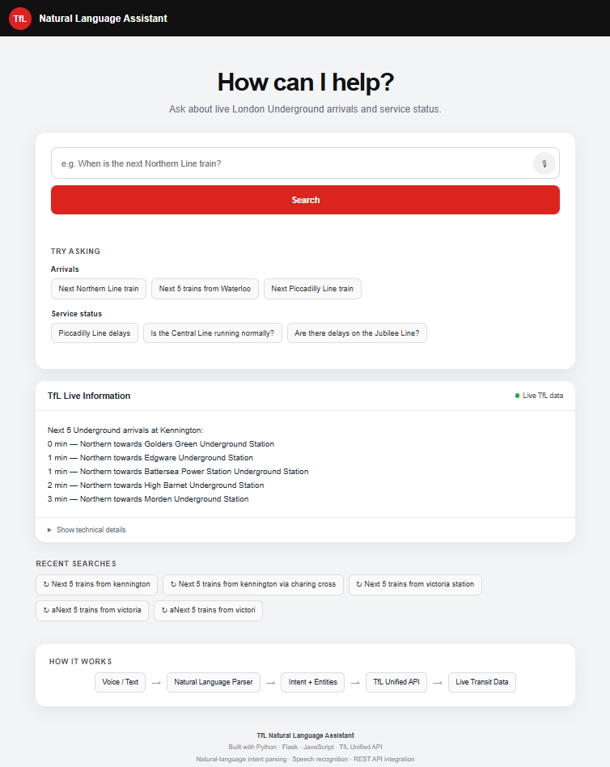

# TfL Natural Language Assistant

A Flask web application that interprets natural-language requests for live London Underground and Elizabeth line information using the TfL Unified API.

## Features

- Natural-language text queries
- Browser voice recognition
- Automatic voice submission
- Tube and Elizabeth line arrivals
- Station arrival searches
- Line service status
- Recent searches stored in the browser
- TfL API integration
- Responsive web interface

## Setup

Open the project in PyCharm.

Create a virtual environment and install:

    python -m pip install -r requirements.txt

Run:

    python app.py

Then open:

    http://127.0.0.1:5000

## Optional API key

The TfL API can be used without an app key for many requests, but an API key can be supplied as the environment variable:

    TFL_APP_KEY

The application automatically adds it to requests when present.

